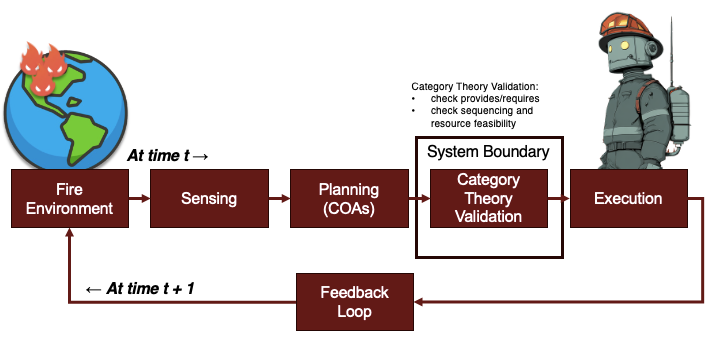
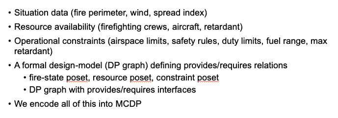
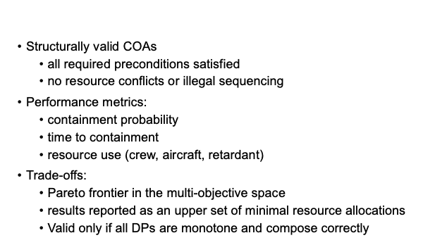
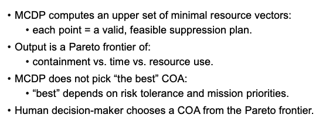
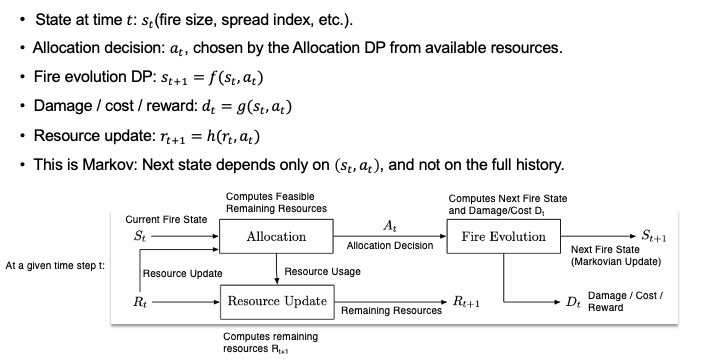
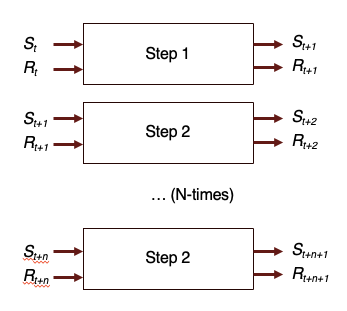
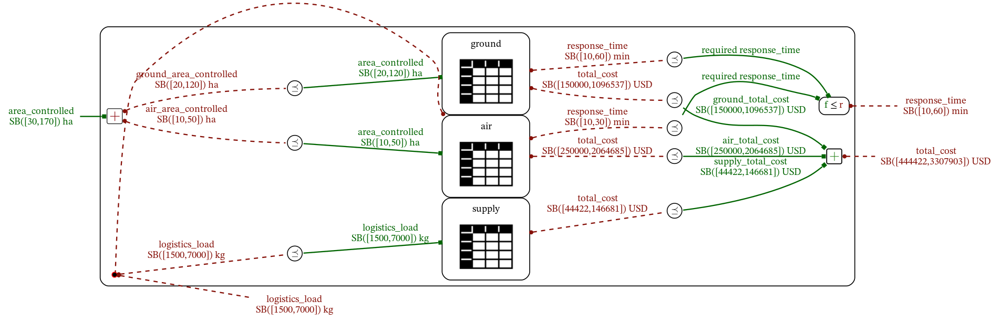
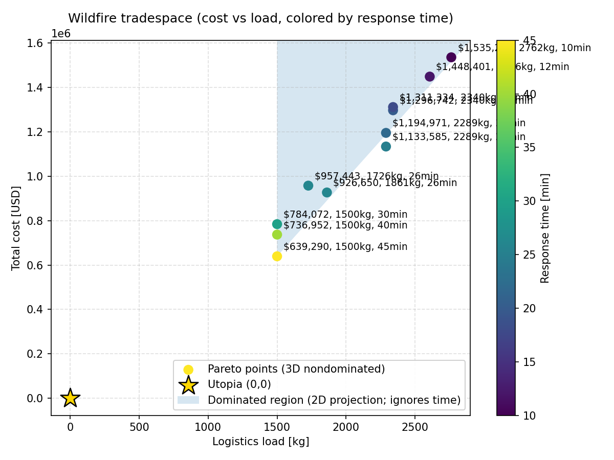

# WildfireCodesign

## BLUF  
Wildfire suppression is a compositional systems problem, not a single optimization.

**What this project builds.**  
A category-theoretic co-design model using Monotone Co-Design Problems (MCDP) that models wildfire suppression by composing aerial assets, ground crews, and logistics support through explicitly defined functions, resources, and partial orders.

**What comes out.**  
A Pareto tradespace where each point represents a feasible, executable system-level design that satisfies all monotone constraints across cost, logistics load, and response time. Rather than selecting a single “optimal” solution via fixed objective weights, the model produces a **Pareto tradespace**.

**Time-step clarification.**  
This model represents a single decision step in time; in practice, the same co-design problem would be re-solved as fire state and available resources change, yielding a sequence of Pareto-optimal decisions rather than a single static plan.

## Overview

Wildfire suppression is a coupled system problem, not a single optimization.

It involves:
- **Aerial assets** (fixed-wing tankers, helicopters, retardant delivery)
- **Ground crews** (handline production, access, containment)
- **Logistics** (retardant supply, lift capacity)
- **Operational constraints** (time, cost, availability)

These elements interact tightly. Improving one dimension (speed, coverage) typically increases pressure elsewhere (cost, logistics). This repository provides a **formal, compositional model** of those tradeoffs.

## Why Category Theory / MCDP

Wildfire suppression is not “optimize one objective with weights.”

Multiple heterogeneous components must be composed, each with its own capabilities and resource demands. Early scalarization hides structure and discards viable options before tradeoffs are visible.

## System Context and Decision-Support Framing

This repository focuses on **formal co-design and structural validation** of wildfire suppression plans using MCDP.  
It is intentionally scoped to a specific portion of a larger wildfire decision-support pipeline.

The figures below situate this work in context and clarify **what is modeled here versus what is out of scope**.

---

### System View and Boundary



**Figure — System view and boundary.**  
This diagram shows where category theory and MCDP sit within a broader wildfire suppression pipeline.

- Upstream components (fire environment, sensing, planning of candidate COAs) are assumed inputs.
- The **system boundary of this project** is the formal validation and tradeoff analysis of candidate suppression plans.
- MCDP is used to:
  - check provides/requires consistency,
  - enforce resource feasibility,
  - and compute feasible trade spaces.

Execution and feedback occur outside the formal model and are treated as exogenous to this work.

---

### System Inputs (What the Model Requires)



**Figure — System inputs and formal model requirements.**

Conceptually, a full wildfire decision-support system would require:

- Situation data (fire perimeter, wind, spread index)
- Resource availability (crews, aircraft, retardant)
- Operational constraints (airspace limits, safety rules, duty limits)
- A formal design model defining provides/requires relations

In this repository, **only the final item is implemented**:
a formal co-design model encoded in MCDP with explicitly defined posets and composition rules.

---

### System Outputs (What the Model Provides)



**Figure — Outputs of the category-theoretic decision-support layer.**

The MCDP model produces:

- Structurally valid suppression packages
- Guaranteed feasibility with respect to defined resources and constraints
- A **Pareto antichain** of minimal resource allocations

Importantly, the model **does not select a single optimal plan**.  
It exposes the trade space so that a human decision-maker can choose based on mission priorities and risk tolerance.

---

### Role of MCDP and the Human Decision-Maker



MCDP computes an **upper set of minimal resource vectors**:

- Each Pareto point corresponds to a valid suppression plan.
- Dominance relationships are preserved across objectives.

The human decision-maker selects a plan from the Pareto frontier based on operational context.
This separation of concerns is intentional and central to the model design.

---

### Relation to Sequential / RL-Based Decision Models



The figures above illustrate how wildfire suppression can be framed as a **sequential decision problem**:

- State → allocation → environment evolution → next state
- Markov structure with resource updates and cost accumulation

This repository **does not implement** this full sequential or RL formulation.
Instead, it focuses on a **single-step allocation problem** that can serve as a building block within such a framework.

---

### N-Step Wildfire Decision Structure (Out of Scope)



The N-step formulation is shown here for conceptual completeness.

- A full implementation would require:
  - explicit fire dynamics,
  - stochastic transitions,
  - and policy optimization over time.
- These elements are **not modeled in this repository**.

The intent is to show that the co-design structure developed here is compatible with extension to multi-step or RL-based formulations, even though that extension is not carried out due to scope and time constraints.

---

### Summary of Scope

**What this project does:**

- Formally models wildfire suppression as a compositional co-design problem
- Defines functions, resources, and posets explicitly
- Computes Pareto-optimal trade spaces with guaranteed feasibility

**What this project does not do:**

- Simulate fire spread or environment dynamics
- Optimize multi-step policies or reinforcement learning agents
- Execute or adapt plans in real time

This is a deliberate scoping choice to emphasize **structural correctness and tradeoff transparency** over end-to-end simulation.

**MCDP models the structure directly.**

- Each component is represented as a **monotone relation** between what it provides and what it requires.
- Components are composed using **category-theoretic operators**.
- Coupling between air, ground, and logistics is explicit and mathematically well-defined.

The result is **not a single optimum**, but a **Pareto antichain** of feasible system designs that preserves dominance relationships across objectives.

## How the Model Is Used

The model produces a tradespace relating:
- suppression performance (area controlled, response time)
- required resources (cost, logistics load)

Each point corresponds to a **feasible suppression package** composed of specific air, ground, and supply choices.

The model does not decide for you.  
It shows you **what tradeoffs exist**.

Examples:
- Faster response often costs more and requires heavier logistics.
- Slower options may be cheaper and easier to sustain.
- Beyond a point, additional resources yield diminishing returns.

The value is clarity, not prescription.

## Scope and Relationship to Planning / RL

This repository focuses on **structural validation and tradeoff analysis**, not action generation.

In the full wildfire decision-support loop, upstream methods such as
reinforcement learning, optimization, or heuristic planners may propose
candidate actions or courses of action (COAs). However, those methods
do not guarantee that the proposed actions are **mutually feasible** when
considered together under shared resource constraints, sequencing rules,
and operational limits.

This project addresses that gap.

Using Monotone Co-Design Problems (MCDP), wildfire suppression actions are
modeled as composable design problems with explicit *provides*/*requires*
interfaces defined over partially ordered sets. Composition ensures that
candidate plans are **structurally valid** before execution.

In this framing:

- **RL / planning methods** propose candidate actions or COAs  
- **MCDP validates structure** (feasibility, resource consistency, sequencing)  
- **Decision-makers** select among Pareto-optimal, executable options  

This repository implements the **validation and trade-space computation
layer** of that architecture. It does not attempt to learn policies, predict
fire spread, or generate actions autonomously.

The intent is to show how category-theoretic composition can be used to
*filter and structure* candidate plans so that downstream decisions are
made only among executable, conflict-free options.

## Co-design Structure

The wildfire system is modeled as a **single compositional design problem**, built from three interacting subsystems.



This diagram captures the structure of the design problem. The tradespace shown later is a consequence of this structure. Each Pareto point, in that tradespace, corresponds to a feasible composition of air, ground, and supply subsystems that satisfies all monotone constraints.

### Components

- **Air (aerial suppression)**  
  Provides area coverage and response time.  
  Requires cost and logistics support.

- **Ground (ground crews)**  
  Provides area coverage and response time.  
  Requires cost.

- **Supply (retardant logistics)**  
  Provides logistics capacity.  
  Requires cost.

These are composed into a **system-level problem** exposing aggregate functions and resources.

### Functions and Resources

**Functions (provided):**
- `area_controlled` [ha]
- `response_time` [min]

**Resources (required):**
- `total_cost` [USD]
- `logistics_load` [kg]

The system exposes the same quantities, with bounds induced by composition.

### Posets and Ordering

All quantities live in **partially ordered sets (posets)**:

- Area controlled: ordered by **≥** (more is better)
- Response time: ordered by **≤** (faster is better)
- Cost: ordered by **≤**
- Logistics load: ordered by **≤**

These orders enforce monotonicity and make dominance well-defined.

### Composition Rules

Subsystems are composed using standard MCDP operators:

- **Area** aggregates additively (air + ground)
- **Cost** aggregates additively (air + ground + supply)
- **Response time** is governed by the slowest component
- **Logistics** must cover aerial demand

This structure is what the solver reasons over.

## Understanding the Co-Design Structure

### How to read the co-design diagram

The diagram above represents the wildfire suppression system as a **compositional co-design problem**, not a sequential workflow!

Each block (air, ground, supply) is modeled as a design problem that relates **what it provides** (functions) to **what it requires** (resources), with all quantities living in explicitly defined partially ordered sets (posets).

At the system level:

- **Aerial and ground subsystems independently provide area control and response time**
- **Total area controlled** is aggregated additively across air and ground assets
- **Response time** is governed by the slowest contributing subsystem (max-like behavior)
- **Logistics load** provided by the supply subsystem must cover the logistics required by air operations
- **Total cost** aggregates across air, ground, and supply subsystems

These relationships are enforced through monotone constraints rather than fixed equations.  
The solver searches for feasible combinations of subsystem designs that satisfy all constraints simultaneously.

The result is not a single optimal architecture, but a **set of nondominated system designs** that preserve the structure of the tradeoffs implied by the system architecture.

## What the Co-Design Model Shows / Does Not Show (i.e. Interpretation and Limits of the Model)

### What this model shows

- The **structural tradeoffs** between cost, logistics burden, and response speed in wildfire suppression
- How **aerial, ground, and logistics subsystems interact** through shared constraints
- Which system designs are **globally nondominated** given the modeled functions and resources
- How additional resources yield **diminishing returns** beyond certain operating regimes

### Why this matters

By separating **structure** from **solution**, the model supports informed decision-making without forcing early commitment to a single objective weighting. It allows you to keep your options (i.e. remain solution neutral).

This is the core advantage of MCDP-style co-design: the architecture remains visible, even as priorities change.

## Tradespace Visualization



**Figure — Wildfire suppression tradespace.**  
Each point is a **Pareto-optimal (nondominated) system design**.

- **X-axis:** logistics load [kg]
- **Y-axis:** total cost [USD]
- **Color:** response time [min] (lower is better)

The gold star marks the **utopia point** (zero cost, zero logistics), shown for reference only.

### About the Shaded Region

The light blue region shows the **dominated area in the 2D projection** (cost vs. logistics load).

Important caveat:
- Optimization is performed in **three dimensions** (cost, load, time)
- Dominance is therefore **3D**, not purely 2D

As a result:
- All plotted points are globally nondominated
- Some points may look dominated in 2D if response time is ignored
- The shading is a **visual aid**, not a feasibility boundary

Read the plot as:
> “These are the viable tradeoffs between cost, logistics burden, and response speed.”

## Interpreting a Pareto Point

### Example tradeoff interpretation

Each point in the tradespace corresponds to a **specific composed system design**, not just a numerical outcome.

For example, a point with:

- **Lower response time**
- **Higher total cost**
- **Higher logistics load**

typically corresponds to a design where:

- A faster (and more expensive) aerial package is selected
- Ground crews contribute less to total area control
- Additional logistics capacity is required to support rapid aerial deployment
- The **response time constraint is binding**, while cost and logistics are traded off

Conversely, points with:

- **Lower cost**
- **Lower logistics burden**
- **Longer response time**

represent designs where:

- Ground crews provide a larger share of area control
- Aerial assets are smaller or slower
- The system accepts slower containment in exchange for reduced resource expenditure

Importantly, none of these points dominate one another across **all three resources** (cost, logistics load, response time).  
Each remains feasible and nondominated because improving one dimension would require sacrificing at least one other.

This is why the model returns a **Pareto antichain**, rather than a single “best” solution.


## Repository Structure

```
WildfireCodesign/
├── wildfire.mcdplib/                 # MCDP library: models, queries, catalogues
│   ├── models/
│   │   └── wildfire.mcdp
│   ├── catalogues/                   # generated YAML design catalogues
│   └── queries/
│       └── wildfire.base_query
├── scripts/                          # utilities for generating catalogues + plots
│   ├── generate_catalogues.py
│   └── plot_wildfire_pareto.py
├── out-query/                        # solver outputs (generated)
│   └── output.yaml
├── assets/                           # figures for README/docs
│   ├── wildfire_tradespace.png
│   └── wildfire-ndp_graph_enclosed_LR.png
├── README.md
└── LICENSE
```

## Quick Start
1. Install Docker Desktop from here: `https://docs.docker.com/desktop/`
1. Download MCDP docker image: `docker pull zupermind/mcdp:2025`
1. checkout code: `git clone git@github.com:michaelwalters/WildfireCodesign.git`
1. cd to project root
1. Launch docker container: `docker run -it --rm -v $PWD:$PWD -w $PWD zupermind/mcdp:2025 bash`
1. Test Installation and First Run of Solver: `mcdp-solve-query --nocache wildfire.base_query`


## Running the MCDP Model in Docker

All commands assume you are starting from the **repository root** on your host machine.

### 1) Launch the container

```bash
docker run -it --rm -v $PWD:$PWD -w $PWD zupermind/mcdp:2025 bash
```

This mounts the repository into the container and drops you into a shell at the repo root.

---

### 2) Generate catalogues

```bash
python scripts/generate_catalogues.py
```

---

### 3) Run the primary query

```bash
mcdp-solve-query --nocache --optimistic 500 wildfire.base_query
```

Output is written to:

```
out-query/output.yaml
```

---

### 4) Plot the tradespace

```bash
python scripts/plot_wildfire_pareto.py --time-max 30 --shade slice
```
This generates Pareto-optimal plots including:

- Pareto points
- A gold star marking the Utopia point
- A shaded dominated region

Move output into assets:

```bash
mv wildfire_tradespace.png assets/wildfire_tradespace.png
```

## Project Video

A short overview video (≤ 3 minutes) will be added here:

YouTube Link (placeholder):  
https://youtu.be/________________

## Presentation Slides

Presentation PDF (placeholder):  
`docs/WildfireCodesign_Presentation.pdf`

## Course Context

This project was developed for:

1.144 — Applied Category Theory for Engineering Design (ACT4ED)  
Massachusetts Institute of Technology  
Fall 2025

Instructor: Prof. Gioele Zardini — https://zardini.mit.edu  
Teaching Assistant: Yujun Huang

### Educational Purpose

This repository is intended for learning and demonstration within MIT’s ACT4ED course.

### Independence

This project reflects the author's own work and does not imply endorsement by course staff or MIT.

### Toolchain Acknowledgment

The MCDP solver and syntax belong to the ACT4ED educational toolchain and are used here for coursework.

### Future Work

Possible extensions include wildfire response modeling, multi-agent co-design, and uncertainty-aware decision support.

## License

Released under the MIT License.
